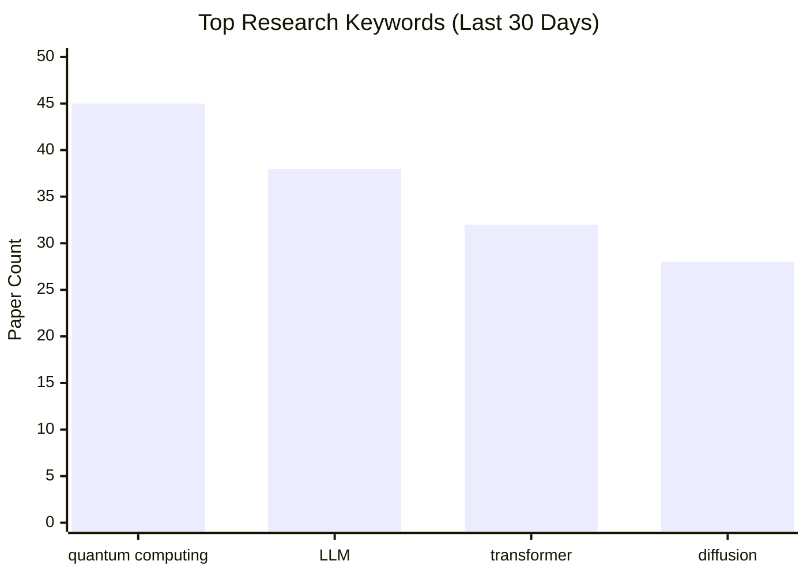

# ArXiv Daily Researcher

> 自动化学术论文监控、筛选与分析系统

[](https://creativecommons.org/licenses/by-nc-sa/4.0/)
[](https://www.python.org/downloads/)

一个基于 LLM 的智能论文研究助手，自动从 ArXiv 和顶级学术期刊获取最新论文，根据你的研究兴趣进行智能评分筛选，并对高相关性论文进行深度分析。

## ✨ 核心功能

- **多数据源支持** - ArXiv 预印本 + 20+ 顶级期刊 (PRL, Nature, Science 等)
- **智能评分系统** - 基于关键词权重的 LLM 评分，自动识别相关论文
- **深度分析** - 下载 PDF 并使用高性能 LLM 提取方法论、创新点、技术栈
- **热点趋势追踪** - 自动统计关键词趋势，生成 Mermaid 可视化图表
- **Markdown 报告** - 生成专业的研究报告，支持中文摘要翻译

---

## 🚀 快速开始

### 1. 克隆项目

```bash
git clone https://github.com/yzr278892/arxiv-daily-researcher.git
cd arxiv-daily-researcher
```

### 2. 安装依赖

```bash
# 创建虚拟环境（推荐）
python -m venv venv

# 激活虚拟环境
# Windows:
venv\Scripts\activate
# Mac/Linux:
source venv/bin/activate

# 安装依赖
pip install -r requirements.txt
```

### 3. 配置 API Key

创建 `.env` 文件：

```bash
cp .env.example .env
```

编辑 `.env`，填入你的 API Key：

```env
# ============================================================
# LLM API 配置 (必填)
# ============================================================

# 低成本 LLM - 用于快速筛选评分 (推荐: gpt-4o-mini, deepseek-chat)
CHEAP_LLM__API_KEY=sk-your-api-key-here
CHEAP_LLM__BASE_URL=https://api.openai.com/v1
CHEAP_LLM__MODEL_NAME=gpt-4o-mini

# 高性能 LLM - 用于深度分析 (推荐: gpt-4o, claude-3-opus)
SMART_LLM__API_KEY=sk-your-api-key-here
SMART_LLM__BASE_URL=https://api.openai.com/v1
SMART_LLM__MODEL_NAME=gpt-4o

# ============================================================
# 可选配置
# ============================================================

# OpenAlex 邮箱 (进入礼貌池，提高 API 速率限制)
# OPENALEX_EMAIL=your-email@example.com

# Semantic Scholar API Key (获取 AI 生成的 TLDR)
# SEMANTIC_SCHOLAR_API_KEY=your-key-here
```

<details>
<summary><b>使用 DeepSeek（更便宜）</b></summary>

```env
CHEAP_LLM__API_KEY=sk-your-deepseek-key
CHEAP_LLM__BASE_URL=https://api.deepseek.com/v1
CHEAP_LLM__MODEL_NAME=deepseek-chat

SMART_LLM__API_KEY=sk-your-deepseek-key
SMART_LLM__BASE_URL=https://api.deepseek.com/v1
SMART_LLM__MODEL_NAME=deepseek-chat
```

</details>

<details>
<summary><b>使用本地 Ollama（完全免费）</b></summary>

1. 安装 Ollama：https://ollama.com/download
2. 下载模型：`ollama pull qwen2.5:7b`
3. 配置 `.env`：

```env
CHEAP_LLM__API_KEY=ollama
CHEAP_LLM__BASE_URL=http://127.0.0.1:11434/v1
CHEAP_LLM__MODEL_NAME=qwen2.5:7b

SMART_LLM__API_KEY=ollama
SMART_LLM__BASE_URL=http://127.0.0.1:11434/v1
SMART_LLM__MODEL_NAME=qwen2.5:14b
```

</details>

### 4. 配置搜索参数

编辑 `search_config.json`：

```jsonc
{
  // 搜索设置
  "search_settings": {
    "search_days": 7,      // 搜索最近 N 天的论文
    "max_results": 100     // 每个数据源最多抓取数量
  },

  // 数据源 (可选: arxiv, prl, pra, nature, science 等)
  "data_sources": {
    "enabled": ["arxiv", "prl"]
  },

  // ArXiv 领域 (完整列表: https://arxiv.org/category_taxonomy)
  "target_domains": {
    "domains": ["quant-ph", "cs.AI"]
  },

  // 你的研究关键词
  "keywords": {
    "primary_keywords": {
      "weight": 1.0,
      "keywords": [
        "quantum computing",
        "quantum machine learning",
        "variational quantum"
      ]
    },
    "research_context": "我的研究方向是量子计算和量子机器学习"
  }
}
```

### 5. 运行

**方式一：使用运行脚本（推荐）**

脚本会自动检查并创建虚拟环境、安装依赖：

```bash
# Linux
./run_daily.sh

# macOS
./run_daily_mac.sh

# Windows PowerShell
powershell -ExecutionPolicy Bypass -File run_daily.ps1
```

**方式二：手动运行**

```bash
python main.py
```

报告将生成在 `data/reports/` 目录，日志保存在 `logs/` 目录。

---

## 📊 功能详解

### 评分系统

系统使用加权评分公式筛选论文：

```
总分 = Σ(关键词相关度 × 权重) + 作者加分
及格分 = 基础分 + 系数 × 总权重
```

- 每个关键词由 LLM 评估相关度 (0-10 分)
- 可配置专家作者列表，匹配时加分
- 及格的论文进入深度分析阶段

### 深度分析

对于通过筛选的论文，系统会：

1. 下载 PDF 全文
2. 使用高性能 LLM 分析
3. 提取：研究方法、主要创新、技术栈、局限性、与你研究的相关性

### 热点趋势追踪

自动追踪关键词出现频率，生成 Mermaid 图表：



---

## 📁 项目结构

```
arxiv-daily-researcher/
├── main.py                 # 主程序入口
├── config.py               # 配置管理
├── search_config.json      # 搜索配置 (用户编辑)
├── .env                    # API Keys (用户创建)
├── agents/
│   ├── search_agent.py     # 论文抓取
│   ├── analysis_agent.py   # LLM 分析
│   ├── reporter.py         # 报告生成
│   ├── keyword_tracker/    # 热点趋势追踪
│   └── sources/            # 数据源适配器
├── data/
│   ├── reports/            # 生成的报告
│   ├── history/            # 已处理论文记录
│   └── keywords.db         # 关键词趋势数据库
└── report_templates/       # 报告模板
```

---

## ⚙️ 高级配置

### 支持的数据源

| 代码 | 期刊 |
|------|------|
| `arxiv` | ArXiv 预印本 |
| `prl` | Physical Review Letters |
| `pra/prb/prc/prd/pre` | Physical Review A-E |
| `prx` / `prxq` | Physical Review X / PRX Quantum |
| `nature` / `nature_physics` | Nature / Nature Physics |
| `science` | Science |

完整列表见 [agents/sources/openalex_source.py](agents/sources/openalex_source.py)

### 从参考文献提取关键词

将你的参考论文 PDF 放入 `data/reference_pdfs/`，启用自动提取：

```jsonc
{
  "keywords": {
    "enable_reference_extraction": true,
    "reference_keywords_config": {
      "max_keywords": 10,
      "similarity_threshold": 0.75
    }
  }
}
```

### 关键词趋势配置

```jsonc
{
  "keyword_tracker": {
    "enabled": true,           // 启用关键词记录到数据库
    "normalization": {
      "enabled": true,         // 启用 AI 关键词标准化
      "batch_size": 50
    },
    "trend_view": {
      "default_days": 30       // 默认展示天数
    },
    "charts": {
      "bar_chart": { "top_n": 15 },
      "trend_chart": { "top_n": 5 }
    },
    "report": {
      "enabled": true,         // 是否生成趋势分析报告
      // 报告生成频率: "daily" | "weekly" | "monthly" | "always"
      // daily: 每天生成
      // weekly: 每周一生成
      // monthly: 每月1号生成
      // always: 每次运行都生成
      "frequency": "weekly"
    }
  }
}
```

---

## 🔧 常见问题

### Q: 如何使用国内 LLM API？

修改 `.env` 中的 `BASE_URL`：

```env
# DeepSeek
CHEAP_LLM__BASE_URL=https://api.deepseek.com/v1
CHEAP_LLM__MODEL_NAME=deepseek-chat

# 智谱 AI
CHEAP_LLM__BASE_URL=https://open.bigmodel.cn/api/paas/v4
CHEAP_LLM__MODEL_NAME=glm-4-flash
```

### Q: 遇到 429 Rate Limit 错误？

- ArXiv API 已内置 6 秒延迟
- 配置 `OPENALEX_EMAIL` 进入礼貌池
- 减少 `max_results` 数量

### Q: 如何定时运行？

使用 cron (Linux/Mac) 或任务计划程序 (Windows)：

```bash
# 每天早上 8 点运行
0 8 * * * cd /path/to/arxiv-daily-researcher && python main.py
```

---

## 📈 Token 消耗估算

每篇论文的 Token 消耗取决于摘要长度和分析深度：

| 分析阶段 | 输入 Token | 输出 Token | 说明 |
|----------|-----------|-----------|------|
| **基础评分** | ~800 | ~300 | 标题 + 摘要 + 评分 prompt |
| **深度分析** | ~8,000 | ~1,500 | PDF 前 15,000 字符 + 分析 prompt |

**示例**：处理 100 篇论文，其中 15 篇进入深度分析

| 阶段 | 计算 | 总 Token |
|------|------|---------|
| 基础评分 | 100 × (800 + 300) | ~110,000 |
| 深度分析 | 15 × (8,000 + 1,500) | ~142,500 |
| **合计** | | **~252,500** |

> 实际消耗因论文摘要长度和 PDF 内容而异，以上为估算值。

---

## 📜 许可证

本项目采用 [CC BY-NC-SA 4.0](https://creativecommons.org/licenses/by-nc-sa/4.0/) 许可证。

- ✅ 可自由使用、修改、分享
- ✅ 需注明原作者
- ❌ 禁止商业使用
- 🔄 衍生作品需使用相同许可证

---

## 📝 更新日志

### v1.2 (最新) - 2026-02-08

**重要修复：**

1. **修复OpenAlex源缩进错误** - 修复了[openalex_source.py:356-377](agents/sources/openalex_source.py#L356-L377)的缩进问题，该错误导致标题、作者、摘要提取代码无法执行

**性能优化：**

2. **翻译缓存机制** - 新增MD5哈希缓存，避免同一论文（arXiv+期刊重复）重复翻译摘要，可节省大量API调用
   - 位置：[main.py:129-209](main.py#L129-L209)
   - 效果：当论文同时出现在arXiv和期刊时，只翻译一次

3. **KeywordTracker实例优化** - 将KeywordTracker移到循环外初始化，减少数据库连接开销
   - 位置：[main.py:118-127](main.py#L118-L127)

**功能增强：**

4. **ArXiv优先策略** - 当期刊论文有arXiv版本时，优先使用ArXiv API获取完整元数据
   - 位置：[openalex_source.py:435-447](agents/sources/openalex_source.py#L435-L447)
   - 优势：规避期刊版权限制，获取完整摘要和可下载PDF
   - 日志标识：`🔄 检测到 arXiv 版本` / `✅ 使用 arXiv 源获取完整元数据`

5. **增强的Semantic Scholar集成** - 改进arXiv版本检测逻辑，同时获取TLDR和arXiv信息

### v1.1 - 2026-02-05

**运行脚本更新：**

- 添加虚拟环境自动检查和安装功能
- 新增 macOS 运行脚本 (run_daily_mac.sh)
- 新增 Windows PowerShell 运行脚本 (run_daily.ps1)
- 增强 Linux 运行脚本 (run_daily.sh)
- 更新 .gitignore 和配置文件

### v1.0 - 2026-02-06

**首次正式发布：**

- 多数据源支持（ArXiv + 学术期刊）
- 智能评分系统（关键词加权）
- 深度 PDF 分析（LLM 驱动）
- 关键词趋势追踪系统
- AI 关键词标准化
- Markdown 报告生成

---

## 🤝 API 使用说明

本项目遵循各 API 提供者的使用规范：

- **ArXiv**: 使用官方 `arxiv` Python 库，内置 6 秒请求延迟
- **OpenAlex**: 请求头包含项目信息和联系方式，建议配置邮箱进入礼貌池
- **Semantic Scholar**: 请求头包含 User-Agent，支持 API Key 提高速率

如有问题请联系：yzr278892@gmail.com

---

## 🙏 致谢

- 本项目在 [Claude](https://www.anthropic.com/claude) (Anthropic) 的协助下开发，使用 [Claude Code](https://claude.ai/code) 进行代码编写和调试
- 感谢 [ArXiv](https://arxiv.org/)、[OpenAlex](https://openalex.org/)、[Semantic Scholar](https://www.semanticscholar.org/) 提供的开放 API

---

## 📬 联系

- GitHub Issues: [提交问题](https://github.com/yzr278892/arxiv-daily-researcher/issues)
- Email: yzr278892@gmail.com

---

如果这个项目对你有帮助，请给一个 ⭐ Star！
