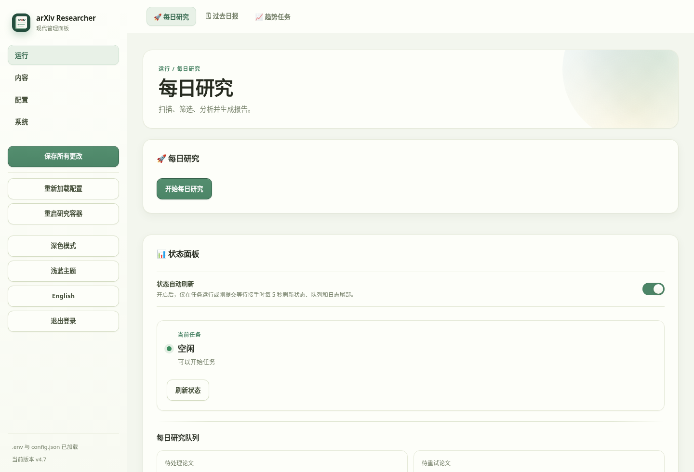
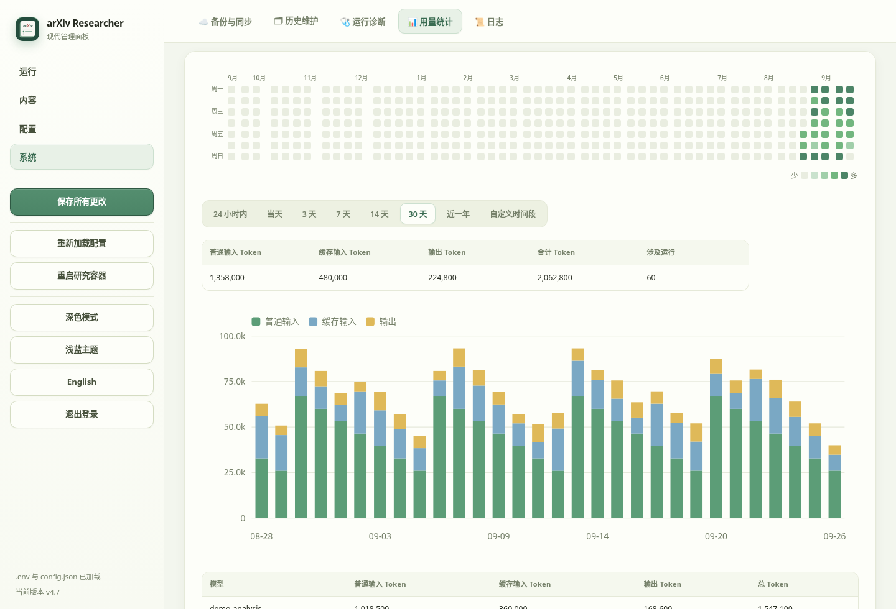
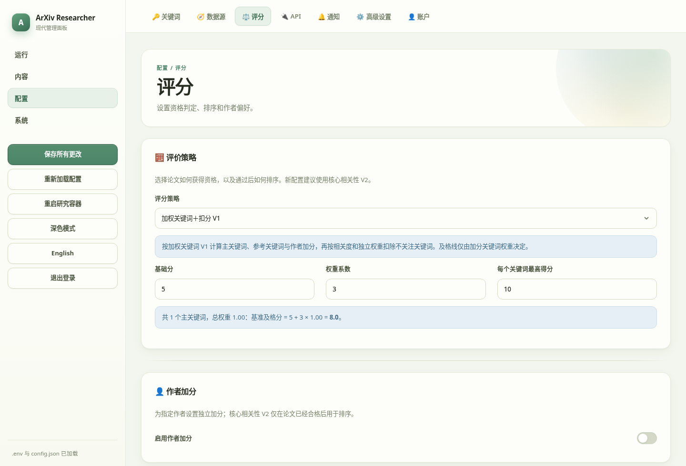
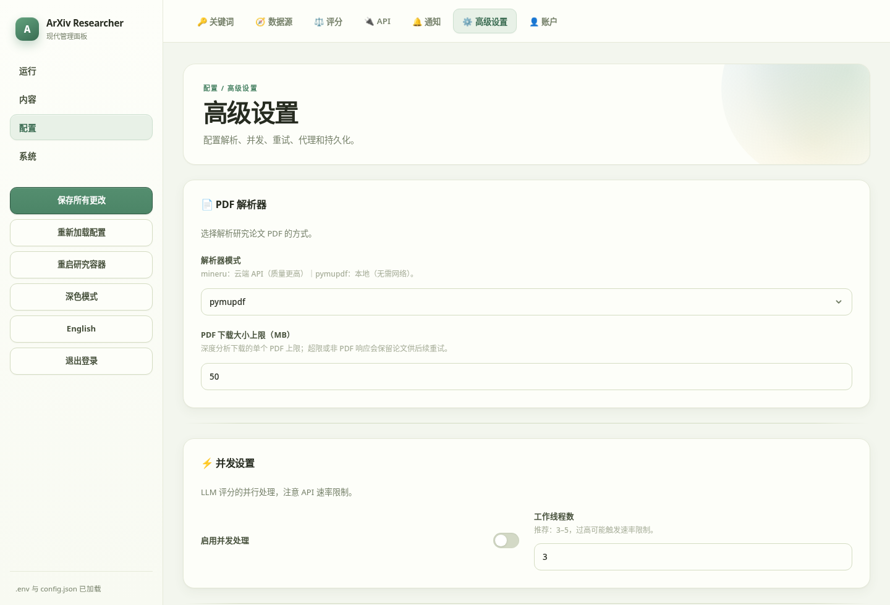
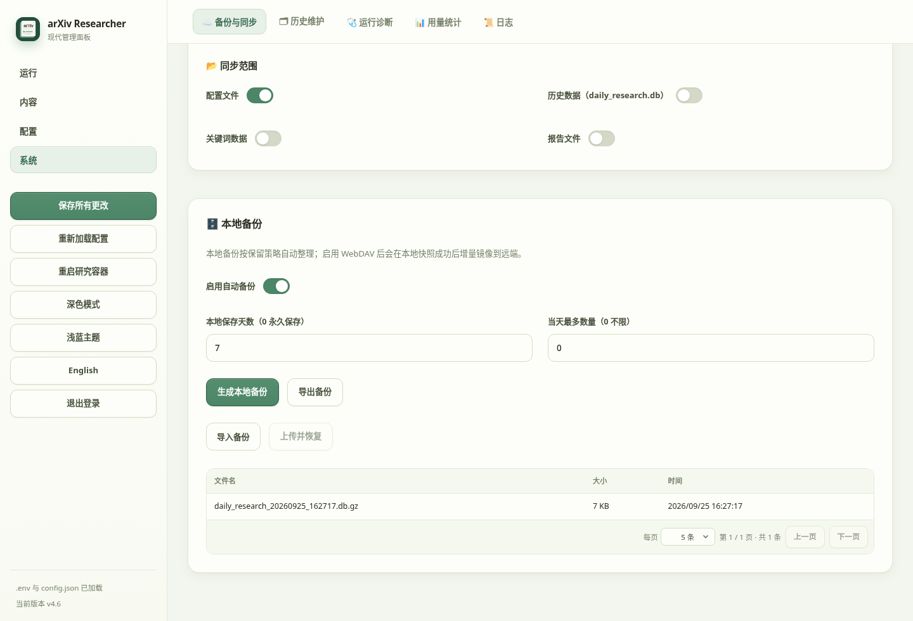
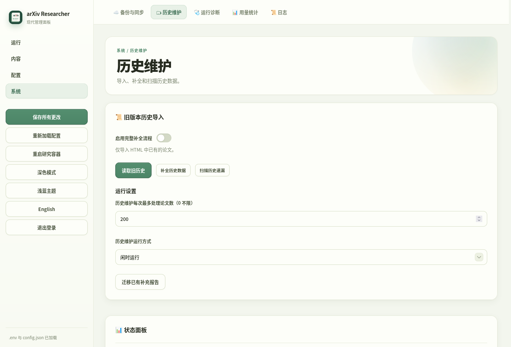

# 🔬 ArXiv Daily Researcher

**基于 LLM 的学术论文监控、筛选、分析、报告与研究归档系统**

*面向日常文献追踪、专题研究与历史资料整理的完整研究工作流。*

---

ArXiv Daily Researcher 从 ArXiv 与可选扩展来源收集论文，按研究主题完成评分、摘要翻译、PDF 分析与趋势整理，并输出 Markdown、HTML 报告和多平台通知。

v4.2 以 SQLite 保存候选论文、处理阶段、报告交付、通知发件箱、历史维护积压与过去日报队列。同一论文可汇集多个来源的元数据与分析变体，任务可从已完成阶段继续运行；运行配置独立于源码目录，适合长期部署与升级。

当前版本提供：

- **每日研究模式**：固定回看最近三天，持续追踪新论文与修订版
- **趋势研究模式**：围绕指定主题、时间范围和分类生成综合研究报告
- **旧历史导入与补充报告**：默认建立 HTML 交付账本；完整修复、字段补全和遗漏扫描可独立执行
- **过去日报队列**：按日期范围补跑历史日期的完整研究流程
- **现代管理 WebUI**：在四组侧栏和 18 个顶部页面中完成配置、运行、报告阅读、诊断与账户管理

---

## ✨ 核心功能

<table>
<tr>
<td colspan="2" align="center">— 数据获取 & 智能筛选 —</td>
</tr>
<tr>
<td width="50%" valign="top">

### 📡 多数据源抓取

以 **ArXiv** 为主来源，完整分页扫描首次提交与最后更新；支持目标分类、公告延迟重扫和扫描收据。额外来源区可启用 PRL、PRA/PRB、Nature、Science、Hugging Face Papers 与声明式期刊来源，并可选接入 OpenAlex、Semantic Scholar 增强信息。同一论文出现在多个来源时，SQLite 会按稳定身份归并记录并保留来源变体。

</td>
<td width="50%" valign="top">

### 🎯 可配置评分策略

提供 **核心相关性 V2**、**加权关键词 V1** 与**偏好学习 V1**。V2 以主关键词的内容相关度和强匹配决定资格，参考关键词与作者偏好参与排序；V1 保留兼容的加权及格线；学习模式依据收藏信号微调排序。

</td>
</tr>
<tr>
<td colspan="2" align="center">— 深度分析 & 可恢复归档 —</td>
</tr>
<tr>
<td width="50%" valign="top">

### 🔍 LLM 与 PDF 分析

<code>CHEAP_LLM</code> 负责评分、译文、关键词与 TLDR；<code>SMART_LLM</code> 负责 PDF 深度分析和趋势总结。PDF 支持本地 **PyMuPDF** 与 **MinerU**，并提供统一的超时、重试、限速和安全错误摘要。

</td>
<td width="50%" valign="top">

### 🗃️ SQLite 队列与精确交付

候选论文先写入 SQLite，再按优先级处理。稳定身份、来源和版本共同控制去重；可合并字段去重汇集，来源专属的摘要或分析作为变体保留。失败阶段留在重试队列，报告写入成功后再提交交付账本、扫描水位线和通知发件箱。

</td>
</tr>
<tr>
<td colspan="2" align="center">— 趋势研究 & 历史整理 —</td>
</tr>
<tr>
<td width="50%" valign="top">

### 🔬 趋势研究模式

<code>trend_research</code> 支持关键词、日期范围与 ArXiv 分类过滤，批量检索相关论文，逐篇生成 TLDR，再由 <code>SMART_LLM</code> 汇总主题演变、研究者、方法、研究空白与发展方向。

</td>
<td width="50%" valign="top">

### 📜 旧历史导入与过去日报

旧 HTML 报告可一键写入 SQLite 交付账本，避免未来日报重复处理。开启完整修复后，系统读取兼容 JSON；论文关键词以 HTML 报告为准，旧关键词缓存仅为同一报告论文的缺失关键词补位。字段补全、报告修补和遗漏扫描均以 SQLite 为依据；遗漏论文按自然周生成补充报告。过去日报按日期范围进入持久队列，逐天执行完整研究流程。

</td>
</tr>
<tr>
<td colspan="2" align="center">— 报告输出 & 通知推送 —</td>
</tr>
<tr>
<td width="50%" valign="top">

### 📄 Markdown + HTML 双格式报告

每日研究、补充报告、过去日报、趋势研究和关键词趋势均支持 Markdown 与 HTML 输出。报告查看页按时间戳排序，提供预览、收藏标记和全文元数据检索。

</td>
<td width="50%" valign="top">

### 🔔 多平台通知与发件箱

支持 **邮件、企业微信、钉钉、Telegram、Slack、通用 Webhook**。日常研究、趋势研究、历史导入、补充运行、过去日报队列和版本更新都会发送结果摘要；暂时失败的通知保存在 SQLite outbox 中等待后续补发。

</td>
</tr>
<tr>
<td colspan="2" align="center">— 配置管理 & 部署运维 —</td>
</tr>
<tr>
<td width="50%" valign="top">

### 🧙 配置向导与现代 WebUI

CLI 配置向导覆盖 LLM、数据源、关键词、评分、通知和高级选项。现代 WebUI 以独立 ASGI 服务运行，提供运行、内容、配置、系统四组页面，支持中英文、浅色/深色主题与账户管理；配置和任务状态始终与 worker 共用同一份持久化数据。

</td>
<td width="50%" valign="top">

### 🛡️ 备份、同步与运行诊断

SQLite 自动生成一致性 gzip 快照：当天保留全部副本，昨天及更早日期每天保留最新一份。WebDAV 采用内容变化时上传的增量归档；运行诊断提供运行、LLM 和来源健康，用量统计提供可选时间段的 Token 折线趋势。

</td>
</tr>
</table>

---

## 📑 导航目录

<table>
<tr>
<td width="50%" valign="top">

### 📘 快速上手

|           章节           | 简介                                      |
| :----------------------: | :---------------------------------------- |
| [✨ 核心功能](#-核心功能) | 数据源、分析、归档与通知能力总览          |
| [🚀 快速开始](#-快速开始) | 三步完成首次配置与运行                    |
| [🛠️ 配置工具](#️-配置工具) | CLI 向导、WebUI 和界面截图                |
| [🐳 部署方式](#-部署方式) | Docker、GHCR、GitHub Actions 与本地定时   |

</td>
<td width="50%" valign="top">

### 📗 深入了解

|            章节            | 简介                                           |
| :------------------------: | :--------------------------------------------- |
|  [📖 功能详解](#-功能详解)  | 工作流、评分、历史任务、报告、备份与同步       |
|  [📁 项目结构](#-项目结构)  | 目录、模块与运行数据说明                       |
|  [❓ 常见问题](#-常见问题)  | LLM、网络、队列、导入、恢复等复杂场景          |
| [📝 更新日志](CHANGELOG.md) | 完整版本变更、发布说明与兼容性记录             |

</td>
</tr>
</table>

---

## 🚀 快速开始

### 第一步：克隆项目

~~~bash
git clone https://github.com/yzr278892/arxiv-daily-researcher.git
cd arxiv-daily-researcher
cp .env.example .env
~~~

Docker 是长期部署的推荐方式；本地 Python 运行和 GitHub Actions 的说明见后文。

### 第二步：完成配置

首次配置可使用交互式向导：

~~~bash
python src/utils/setup_wizard.py
~~~

Docker 用户也可以先启动 WebUI，在浏览器中完成配置：

~~~bash
docker compose up -d --build
~~~

打开 <http://127.0.0.1:8501>，填写 LLM、数据源、关键词、评分、通知和运行时间。WebUI 默认绑定本机地址，适合配合 VPN 或带认证的反向代理访问。

Docker 会以 `.env` 中的 `PUID` / `PGID` 写入 `data`、`logs`、`configs`、`runtime` 和 `.env`，避免 NAS 挂载目录出现 root 所有文件。升级自旧镜像且已有 root 所有文件时，可临时加入 `ADR_REPAIR_OWNERSHIP=true` 启动一次，确认权限恢复后删除该项。

运行配置保存在被 Git 忽略的 <code>runtime/config.json</code>；仓库内的 <code>configs/config.example.json</code> 仅作示例。升级 v4.1 及更早版本时，首次启动会安全复制旧的 <code>configs/config.json</code>，原文件保留以便回滚。

通过 Git 拉取源码升级的 v4.1 用户，请在第一次 <code>git pull</code> 前执行一次迁移，避免 Git 删除旧的受跟踪配置文件：

~~~bash
if [ -f configs/config.json ] && [ ! -f runtime/config.json ]; then
  mkdir -p runtime
  mv configs/config.json runtime/config.json
fi
~~~

WebUI 默认启用管理员登录。首次仅在本机地址完成账户初始化，密码以加盐哈希写入 `.env`；会话默认有效期为 7 天，并对连续错误尝试限流。可信内网可在首次初始化时选择跳过登录；面板仍建议置于 VPN 或带 HTTPS 与访问控制的反向代理之后。

<b>手动配置</b>

**1）填写 LLM 环境变量：**

~~~env
CHEAP_LLM__API_KEY=sk-your-key
CHEAP_LLM__BASE_URL=https://api.openai.com/v1
CHEAP_LLM__MODEL_NAME=gpt-4o-mini

SMART_LLM__API_KEY=sk-your-key
SMART_LLM__BASE_URL=https://api.openai.com/v1
SMART_LLM__MODEL_NAME=gpt-4o
~~~

**2）设置研究主题与 ArXiv 分类：**

~~~bash
mkdir -p runtime
cp configs/config.example.json runtime/config.json
~~~

~~~json
{
  "keywords": {
    "primary_keywords": {
      "entries": [
        {"keyword": "quantum error correction", "weight": 1.0},
        {"keyword": "surface code", "weight": 0.8}
      ]
    },
    "research_context": "容错量子计算与量子纠错码"
  },
  "data_sources": {
    "enabled": ["arxiv"]
  },
  "target_domains": {
    "domains": ["quant-ph"]
  }
}
~~~

<code>runtime/config.json</code> 支持 JSONC 注释。面板保存配置时会保留已有注释与当前会话之外页签的设置。

### 第三步：运行

~~~bash
# Docker：启动 worker 与 WebUI
docker compose up -d --build

# 本地 Python：安装依赖后运行每日研究
python -m venv venv
source venv/bin/activate
pip install -r requirements-core.txt -r requirements-webui.txt
python main.py

# 趋势研究示例
python main.py --mode trend_research --keywords "quantum error correction"
~~~

首次运行建议把“本次最多处理论文数”设为 <code>5</code>，确认报告、SQLite、通知和日志符合预期后再调整为日常上限或 <code>0</code>（处理全部队列）。

运行数据默认保存在：

- 报告：<code>data/reports/</code>
- SQLite：<code>data/daily_research/daily_research.db</code>
- 备份：<code>data/backups/</code>
- 日志：<code>logs/</code>

---

## 🛠️ 配置工具

项目提供两种主要配置方式：**CLI 配置向导**与 **现代管理 WebUI**。

### 🧙 交互式配置向导

适合首次部署、SSH 环境与无头服务器：

~~~bash
python src/utils/setup_wizard.py
~~~

| 步骤  | 内容       | 说明                                                   |
| :---: | :--------- | :----------------------------------------------------- |
|   1   | LLM 配置   | 填写 CHEAP_LLM、SMART_LLM 与连接参数                   |
|   2   | 数据源     | ArXiv 开关、分类、额外来源与可选第三方 API             |
|   3   | 关键词     | 主关键词、研究背景、参考文献关键词提取                 |
|   4   | 评分       | 选择评分策略、阈值、权重和作者偏好                     |
|   5   | 通知       | 通知总开关、渠道凭据与结果通知选项                     |
|   6   | 高级设置   | PDF 解析、并发、重试、日志、代理、备份与 WebDAV        |

向导写入前展示配置摘要，并为已有配置创建备份文件。

---

### 🖥️ 现代管理 WebUI

#### 启动方式

~~~bash
# 本地运行
uvicorn src.modern_webui.app:app --host 127.0.0.1 --port 8501

# Docker 运行
docker compose up -d config-panel
~~~

Docker 与本地面板地址：<http://127.0.0.1:8501>

默认只监听本机。若仅需从可信 Tailscale 网络访问，可在 `.env` 填入本机的 Tailscale IPv4 后重建 WebUI：

~~~env
ADR_WEBUI_BIND_HOST=100.x.y.z
~~~

~~~bash
docker compose up -d --no-deps --force-recreate config-panel
~~~

随后打开 `http://100.x.y.z:8501`。此方式保持 Docker 的宿主机网络语义，不需要 `ports:` 映射；请勿设为 `0.0.0.0`，并应先完成 WebUI 管理员账户初始化。

WebUI 与 worker 共享 <code>.env</code>、<code>configs/</code>、<code>data/</code> 和 <code>logs/</code>。左侧一级导航分为运行、内容、配置、系统；二级页面保留在顶部，避免在长配置页中丢失上下文。保存后的配置会在下一次任务加载；修改运行时间后可通过侧栏按钮重启 worker 以重装 cron。

#### 18 个页面与导航分组

| 分组 | 顶部页面 | 功能 |
| :--- | :------- | :--- |
| **运行** | **每日研究**、**过去日报**、**趋势任务** | 启动研究、查看状态与队列；过去日报按日期范围逐日执行；趋势任务可独立设置关键词、时间段、分类和分析配置 |
| **内容** | **报告**、**收藏**、**检索** | 分类浏览 HTML 报告与预览、在报告内标记 👍/👎、查看收藏画像，并检索 SQLite 全库论文与来源变体 |
| **配置** | **关键词**、**数据源**、**评分**、**API**、**通知**、**高级设置**、**账户** | 管理研究主题、来源、评分策略、LLM/PDF/第三方 API、通知、运行参数和管理员账户 |
| **系统** | **备份与同步**、**历史维护**、**运行诊断**、**用量统计**、**日志** | 管理导出、WebDAV 与本地备份；执行旧历史维护；检查运行/LLM/来源健康、Token 折线图和原生日志 |

### 🖼️ WebUI 界面预览

<table>
  <tr>
    <td align="center" width="33%">
      
       
      每日研究、状态面板与队列
    </td>
    <td align="center" width="33%">
      
       
      Token 用量、时间段与折线趋势
    </td>
    <td align="center" width="33%">
      
       
      评分策略与资格逻辑说明
    </td>
  </tr>
  <tr>
    <td align="center" width="33%">
      
       
      PDF 解析与关键词趋势设置
    </td>
    <td align="center" width="33%">
      
       
      本地备份与保留期设置
    </td>
    <td align="center" width="33%">
      
       
      v3.2 旧版本历史导入入口
    </td>
  </tr>
</table>

截图使用脱敏测试配置生成，未展示 API Key、密码、Webhook、邮箱、内网地址或本机路径。

<b>配置向导与 WebUI 如何选择？</b>

| 工具                             | 适用场景                    | 特点                                                   |
| :------------------------------- | :-------------------------- | :----------------------------------------------------- |
| **配置向导** (<code>setup_wizard.py</code>) | 首次部署、SSH、无浏览器环境 | 按步骤完成初始化，适合键盘操作与配置复核               |
| **现代 WebUI** (<code>src/modern_webui/</code>) | 日常调参、运行观察、报告阅读 | 四组侧栏、18 个顶部页面，提供状态、队列、报告、备份、诊断和连接测试 |

首次安装可从配置向导开始；长期运行时使用面板管理日常任务会更直观。

---

## 🐳 部署方式

### Docker 部署 推荐

Docker Compose 启动两个服务：

- <code>arxiv-daily-researcher</code>：worker、cron、队列监听和研究任务
- <code>config-panel</code>：默认监听本机 <code>127.0.0.1:8501</code> 的现代管理 WebUI

#### 从源码构建

~~~bash
git clone https://github.com/yzr278892/arxiv-daily-researcher.git
cd arxiv-daily-researcher
cp .env.example .env
docker compose up -d --build
docker compose ps
~~~

#### 使用 GHCR 托管镜像

v4.2 同时提供 x86_64 和 ARM64 镜像。生产部署可使用对应的固定版本标签：

~~~bash
export ADR_WORKER_IMAGE=ghcr.io/yzr278892/arxiv-daily-researcher:4.2
export ADR_WEBUI_IMAGE=ghcr.io/yzr278892/arxiv-daily-researcher-config-panel:4.2

docker compose pull
docker compose up -d --no-build --force-recreate
docker compose ps
~~~

<code>latest</code> 提供最新正式版本；固定版本标签便于安排升级、回滚与验证。每个 <code>v&lt;版本号&gt;</code> Git tag 都会先通过完整回归，再发布 AMD64/ARM64 镜像。

#### 常用命令

~~~bash
# 查看状态与健康检查
docker compose ps

# 查看 worker 或 WebUI 日志
docker compose logs -f arxiv-daily-researcher
docker compose logs -f config-panel

# 重建本地源码镜像并重建容器
git pull
docker compose build
docker compose up -d --force-recreate

# 在 worker 容器中执行趋势研究
docker compose exec arxiv-daily-researcher python main.py --mode trend_research \
  --keywords "quantum error correction" \
  --date-from 2026-01-01 \
  --categories quant-ph

# 停止服务
docker compose down
~~~

#### WebUI 任务触发机制

WebUI 通过共享卷写入任务触发请求，worker 监听触发队列并启动对应模式。状态、阶段心跳、停止请求和日志都写入共享运行目录，因此面板能够显示任务进度、队列和结果。

<b>Docker 运行参数</b>

| 参数或设置                         | 默认值          | 说明                                                        |
| :--------------------------------- | :-------------- | :---------------------------------------------------------- |
| <code>TZ</code>                    | <code>Asia/Shanghai</code> | 容器时区                                                     |
| <code>daily_research.run_time</code> | <code>12:00</code> | 每日研究时间，在 WebUI 或 <code>runtime/config.json</code> 中设置 |
| <code>RUN_ON_STARTUP</code>        | <code>false</code> | 容器启动后立即执行一轮每日研究                              |
| <code>MODE</code>                  | <code>cron</code> | <code>cron</code> 为常驻调度，<code>run-once</code> 为单次运行 |
| <code>SETUP_WIZARD</code>          | <code>auto</code> | 首次部署时检查并启动配置向导                                |
| <code>ADR_WORKER_IMAGE</code>      | 本地 worker 镜像 | 指定 GHCR worker 镜像                                       |
| <code>ADR_WEBUI_IMAGE</code>       | 本地 WebUI 镜像  | 指定 GHCR WebUI 镜像                                        |
| <code>ADR_WEBUI_BIND_HOST</code>   | <code>127.0.0.1</code> | WebUI 监听地址；可信 Tailnet 直连可填本机 Tailscale IPv4，勿设为 <code>0.0.0.0</code> |

<b>使用本地 OpenAI 兼容 LLM</b>

worker 使用宿主机网络，Linux/NAS 上的本地服务可通过回环地址访问：

~~~env
CHEAP_LLM__API_KEY=ollama
CHEAP_LLM__BASE_URL=http://127.0.0.1:11434/v1
CHEAP_LLM__MODEL_NAME=qwen2.5:7b
~~~

worker 与 WebUI 都使用宿主机网络，以相同方式访问宿主机上的本地 LLM、代理和 DNS。面板默认绑定 <code>127.0.0.1:8501</code>；反向代理、VPN 或本地服务地址应按部署网络拓扑配置。

---

### GitHub Actions 云端运行

适合需要临时云端执行的场景。仓库提供：

- <code>daily-run.yml</code>：每日研究，定时触发默认关闭
- <code>trend-research.yml</code>：手动趋势研究
- <code>test.yml</code>：主分支与 Pull Request 完整回归
- <code>publish-containers.yml</code>：版本 tag 的测试与 GHCR 发布

GitHub Actions 运行时需要可访问的 OpenAI 兼容 LLM 服务，并使用 Actions 缓存保存 SQLite 状态。

#### 配置步骤

1. Fork 本仓库
2. 打开 **Settings → Secrets and variables → Actions**
3. 配置所需 Secrets
4. 在确认 LLM、通知和缓存策略后启用每日调度

| Secret 名称                     | 必填  | 说明                                 |
| :------------------------------ | :---: | :----------------------------------- |
| <code>CHEAP_LLM_API_KEY</code>    |   ✅   | 日常评分、翻译、TLDR 使用的 API Key  |
| <code>CHEAP_LLM_BASE_URL</code>   |   ✅   | CHEAP_LLM OpenAI 兼容 API 地址       |
| <code>CHEAP_LLM_MODEL_NAME</code> |   ✅   | CHEAP_LLM 模型名称                   |
| <code>SMART_LLM_API_KEY</code>    |   ✅   | 深度分析与趋势总结使用的 API Key     |
| <code>SMART_LLM_BASE_URL</code>   |   ✅   | SMART_LLM OpenAI 兼容 API 地址       |
| <code>SMART_LLM_MODEL_NAME</code> |   ✅   | SMART_LLM 模型名称                   |
| 通知相关 Secrets                | 可选  | SMTP、Telegram、Webhook 等           |
| 第三方来源 API Key              | 可选  | OpenAlex、Semantic Scholar、MinerU   |

<code>daily-run.yml</code> 中的 <code>schedule:</code> 以注释形式提供。配置完成后可按需要开启；每日研究固定回看最近三天，更早日期通过过去日报队列补跑。

---

### 本地定时运行（系统 Cron）

也可以使用系统 Cron 执行每日研究：

~~~bash
crontab -e
0 12 * * * cd /path/to/arxiv-daily-researcher && /path/to/venv/bin/python main.py >> /path/to/arxiv-daily-researcher/logs/cron.log 2>&1
~~~

使用系统 Cron 时，请让 worker、WebUI、SQLite、报告和日志指向同一项目目录。

---

## 📖 功能详解

### 🔄 两种主要研究模式

| 维度     | <code>daily_research</code>（默认）              | <code>trend_research</code>                         |
| :------- | :----------------------------------------------- | :--------------------------------------------------- |
| 定位     | 持续追踪近期论文与修订版                         | 围绕指定主题进行专题研究                             |
| 数据源   | ArXiv 与已启用的额外来源                         | ArXiv                                                |
| 时间范围 | 固定最近 3 天，结合扫描水位线恢复窗口            | 任意日期范围                                         |
| 筛选方式 | 评分策略、队列优先级与可选 PDF 分析              | 关键词检索后逐篇 TLDR                                |
| 核心分析 | 评分、中文摘要、关键词、PDF 深度分析              | 主题、时间演变、研究者、空白与方法趋势综合分析       |
| 触发方式 | Cron / Docker / Actions / WebUI / CLI             | CLI / WebUI / Actions                                |
| 输出路径 | <code>data/reports/daily_research/</code>         | <code>data/reports/trend_research/</code>            |

### 📜 历史维护任务

| 模式                          | 入口与条件                                      | 结果                                                |
| :---------------------------- | :---------------------------------------------- | :-------------------------------------------------- |
| <code>legacy_import</code>    | 系统 → 历史维护“读取旧历史”，等待其他任务空闲 | 默认仅登记旧 HTML 的论文交付；完整修复读取兼容 JSON，并仅为同一 HTML 论文补齐缺失关键词后衔接维护 |
| <code>history_data_repair</code> | 系统 → 历史维护“补全历史数据”                | 以 SQLite 为依据补全评分、TL;DR、译文或深度分析，并回写原报告 |
| <code>history_omission_scan</code> | 系统 → 历史维护“扫描历史遗漏”                | 扫描 SQLite 覆盖的各来源时间范围，按自然周和单次上限生成补充报告 |
| <code>supplement_run</code>   | 导入自动衔接或 CLI 手动运行                      | 处理补充积压并生成补充报告                          |
| <code>backfill_run</code>     | 运行 → 过去日报选择日期范围，或 CLI 传入范围      | 按天写入持久队列，生成过去日期对应的每日研究报告    |

### 📅 每日研究流水线

~~~text
1. 读取配置、运行锁、空闲闸门和上次成功扫描水位线
2. 完整扫描 ArXiv 首次提交与最后更新，并记录每个来源的扫描收据
3. 将候选写入 SQLite，恢复失败阶段与补充积压优先级
4. 按本次处理上限执行评分、摘要翻译、关键词提取和内容校验
5. 对符合条件的论文执行 PDF 解析与 SMART_LLM 深度分析
6. 写入 HTML / Markdown 报告
7. 在同一 SQLite 事务中提交论文交付、运行终态、水位线和通知 outbox
8. 执行备份、WebDAV 增量同步、关键词维护与通知补发
~~~

<code>max_papers_per_run</code> 仅限制评分、翻译和分析阶段；完整扫描与候选入队保持独立。<code>0</code> 表示当前运行处理全部可用队列。

### 🔬 趋势研究流水线

~~~text
1. 按关键词、日期范围与分类搜索 ArXiv
2. 为每篇论文生成 TLDR，并保留来源与日期信息
3. 由 SMART_LLM 综合分析主题、时间演变、研究者、空白和方法趋势
4. 输出 Markdown、HTML 与 metadata.json
5. 写入运行记录并发送趋势研究结果通知
~~~

### 🎯 评分策略与资格判断

| 策略                            | 资格判断                                                   | 排序与适用场景                                           |
| :------------------------------ | :--------------------------------------------------------- | :------------------------------------------------------- |
| **核心相关性 V2**               | 主关键词加权平均相关度达到阈值，且至少一个主关键词强匹配   | 推荐新配置；参考关键词、专家作者和收藏偏好提供排序信号   |
| **加权关键词 V1（兼容）**       | 关键词相关度、参考词和作者加分按权重汇总，并与及格线比较   | 适合延续既有 V1 配置与报告                               |
| **偏好学习 V1**                 | 使用 V1 资格规则                                           | 将收藏、忽略和既有通过记录转化为受限、衰减的排序偏好     |

V1 及格线的配置形式为：

~~~text
及格线 = base_score + weight_coefficient × Σ(关键词权重)
~~~

V2 的阈值、强匹配条件与排序信号都在“配置 → 评分”页配置。评分结果会保留非敏感审计证据，便于在报告和“系统 → 运行诊断”复核。

### 📡 数据源与扫描收据

- **ArXiv**：主来源，按分类完整分页，并分别覆盖首次提交和最后更新
- **额外来源**：通过独立开关启用内置来源与声明式来源定义
- **OpenAlex**：用于额外期刊数据；配置 API Key 可使用官方配额
- **Semantic Scholar**：提供可选 TLDR、引用等增强数据
- **来源健康**：每次扫描生成终态收据，系统 → 运行诊断展示最近状态、成功率、候选数量与错误摘要

扫描完成并安全交付后，水位线才会推进。短暂网络问题会通过重试、退避和后续恢复窗口处理。

### 🔍 PDF 解析与内容分析

| 模式         | 适用场景                         | 配置位置                               |
| :----------- | :------------------------------- | :------------------------------------- |
| <code>pymupdf</code> | 本地运行、常规 PDF、简洁部署       | 高级设置 → PDF 解析器                 |
| <code>mineru</code>  | 复杂版式、结构化文本需求较高       | API → MinerU；选择后展开相关配置      |

MinerU 连接测试和官方 API 控制台链接位于 WebUI API 页。任务在解析服务异常时会记录阶段摘要，并使用可用的本地解析路径继续处理。

### 📈 关键词趋势与收藏偏好

关键词模块负责：

1. 保存评分阶段提取的关键词
2. 在每日 0 点执行批量标准化
3. 按配置频率生成关键词趋势报告
4. 在收藏与检索页汇总收藏关键词与作者 Top

参考文献 PDF 关键词提取独立受开关控制。关闭后，缓存关键词不会参与评分；已提取关键词按页展示，便于在较长列表中查看。

### 🔒 运行互斥与恢复

| 场景                        | 协调方式                                               |
| :-------------------------- | :----------------------------------------------------- |
| 每日研究                    | <code>daily_research.lock</code> 与每日工作流闸门      |
| 趋势研究                    | 按参数哈希生成的趋势研究锁                             |
| 旧历史导入、历史补全与遗漏扫描 | 独占历史活动闸门，等待日常任务、趋势研究和维护任务空闲 |
| 补充报告与过去日报          | 共享每日工作流闸门，顺序写入同一 SQLite 队列与交付账本 |

锁状态以内核文件锁为准；运行信息中的 PID 和时间用于诊断。WebUI 可显示活动任务、阶段心跳、队列和停止请求。

### 📄 报告系统

#### 每日研究、补充报告与过去日报

路径：

- <code>data/reports/daily_research/markdown/&lt;source&gt;/</code>
- <code>data/reports/daily_research/html/&lt;source&gt;/</code>

内容包含运行摘要、论文列表、评分、译文、深度分析、关键词与 Token 统计。补充报告会标注“补充报告”；过去日报文件名保留目标日期和实际运行时分秒，以便与同日其他报告稳定排序。

通过“报告查看”打开旧版 HTML 日报时，面板会在预览中注入可持久化的 👍 / 👎 标记控件；归档文件保持原样，因此直接打开磁盘中的 HTML 文件不会附加这些控件。

#### 趋势研究报告

路径：

- <code>data/reports/trend_research/markdown/&lt;keyword_slug&gt;/</code>
- <code>data/reports/trend_research/html/&lt;keyword_slug&gt;/</code>

同时生成 <code>metadata.json</code>，保存研究参数和论文元数据。

#### 关键词趋势报告

路径：

- <code>data/reports/keyword_trend/markdown/</code>
- <code>data/reports/keyword_trend/html/</code>

### 🔔 通知系统

支持 Email、企业微信、钉钉、Telegram、Slack 和通用 Webhook。

通知配置分为：

1. 全局通知开关
2. 渠道独立开关与凭据
3. 任务结果、失败摘要、附件和更新提醒选项

大型任务以一个汇总通知呈现结果。部分完成、延后或失败时，消息包含发生问题的阶段和简短摘要；通知 outbox 保留待投递项目并在后续任务中补发。

### 🗄️ SQLite 备份与 WebDAV

| 项目             | 行为                                                                 |
| :--------------- | :------------------------------------------------------------------- |
| 本地 SQLite 备份 | 每次每日运行完成后创建一致性 gzip 快照；当天保留全部，旧日期每天保留最新一份 |
| 保留期           | WebUI 可设置任意非负整数；默认 7 天，<code>0</code> 表示永久保留      |
| WebDAV 归档      | 数据库内容变化时增量上传；远端快照持续保留                           |
| 同步范围         | 配置、SQLite 历史库、关键词和报告可按范围选择                       |
| 恢复             | 系统 → 备份与同步支持 zip、gz、db 导入导出，并在导入前校验归档     |

恢复前请停止写入 SQLite 的任务，并先生成当前数据导出包。

---

## 📁 项目结构

~~~text
arxiv-daily-researcher/
├── main.py                       # CLI 入口与模式分发
├── VERSION                       # 发布版本号
├── .env.example                  # 环境变量模板
├── requirements-core.txt         # worker / CLI 依赖
├── requirements-webui.txt        # 现代 ASGI WebUI 依赖
├── docker-compose.yml            # worker + config-panel 编排
├── docker/
│   ├── Dockerfile                # worker / webui 多阶段镜像
│   └── entrypoint.sh             # cron、trigger watcher 与 worker 启动
├── configs/
│   ├── config.example.json       # JSONC 示例配置
│   └── templates/                # 报告、邮件与通知模板
├── runtime/
│   └── config.json               # 本机运行配置（Git 忽略）
├── src/
│   ├── modes/                    # daily / trend / legacy / supplement / backfill
│   ├── agents/                   # 评分、分析、关键词与趋势 Agent
│   ├── sources/                  # ArXiv、OpenAlex、HF Papers 等来源
│   ├── report/                   # 每日、趋势、关键词趋势报告
│   ├── notifications/            # 多渠道通知与 SQLite outbox
│   ├── keyword_tracker/          # 关键词标准化与趋势
│   ├── utils/                    # SQLite、队列、锁、备份、同步、健康检查
│   └── modern_webui/             # 现代 ASGI WebUI、静态前端与 i18n
├── .github/workflows/            # Actions 研究、测试与镜像发布工作流
├── data/                         # SQLite、报告、队列、备份（运行时生成）
├── logs/                         # 系统与每次任务日志（运行时生成）
├── assets/                       # README 截图
└── tests/                        # 回归测试
~~~

---

## ❓ 常见问题

<b>1. LLM 返回空正文、超时或部分论文进入重试队列，如何处理？</b>

先查看“系统 → 运行诊断 → LLM 健康”，其中展示真实调用的最近终态、连续失败、成功率、最近成功时间和脱敏错误摘要。

- 401、403、404、400：核对 API Key、Base URL、模型名称和网关兼容性
- 429、5xx、超时、空正文：系统会执行统一重试和退避，并保留未完成阶段
- 修复供应商或网络后：再次运行每日研究或补充运行，系统会复用已完成阶段

对于仅支持 Chat Completions 的兼容网关，首次确认 <code>/responses</code> 不受支持后，系统会记录端点能力并跳过后续无效回退。运行日志会保留一条脱敏诊断；若两个端点均不可用，请修正服务地址、模型或网关配置。

SQLite 队列和报告交付账本由程序维护，恢复期间建议通过面板或 CLI 继续任务。

<b>2. Docker 在网络调整后无法解析 ArXiv 域名，应该如何排查？</b>

<code>NameResolutionError</code> 或 <code>Temporary failure in name resolution</code> 通常来自宿主机、Docker 或 VPN 的 DNS 状态。可依次检查宿主机和 worker：

~~~bash
getent hosts export.arxiv.org
docker exec arxiv-daily-researcher getent hosts export.arxiv.org
docker exec arxiv-daily-researcher cat /etc/resolv.conf
~~~

先恢复宿主机的上游 DNS，再重建容器：

~~~bash
docker compose up -d --force-recreate
~~~

需要固定 DNS 时，可在本机创建 <code>docker-compose.override.yml</code>，并按所在网络环境填写可用解析服务器。

<b>3. 旧版本历史导入为什么会进入等待状态？</b>

旧历史导入以独占方式访问 SQLite。每日研究、趋势研究、关键词维护、补充运行或过去日报执行期间，导入请求会保存在触发队列中；worker 空闲后自动认领。

可在“系统 → 历史维护”的状态面板或“系统 → 日志”查看队列状态和 <code>legacy_import_*.log</code>。独立维护任务分别写入 <code>history_data_repair_*.log</code> 与 <code>history_omission_scan_*.log</code>。同一时间保留一个同类请求即可。

<b>4. 旧历史导入如何处理重复分析、缺失数据和遗漏论文？</b>

默认的“读取旧历史”解析旧 HTML 中已有的论文卡片并建立交付账本，不调用 LLM，也不扫描遗漏。它适合升级后先避免重复推送。

“完整修复旧历史”会按稳定论文身份合并记录，并按报告时间选择最新分析；兼容 JSON 会写入 SQLite。HTML 卡片中的提取关键词直接写入论文评分记录；只有同一张已分析 HTML 卡片没有关键词时，系统才会只读查询 <code>data/keywords/keywords.db</code> 为该论文补位。旧库的规范词、别名和统计缓存不会迁移，当前 SQLite 的标准化流程统一管理这些数据。缺失 TL;DR、译文或深度分析由“历史数据补全”基于 SQLite 修复并回写原报告；时间段扫描发现的遗漏按 ISO 自然周进入补充报告队列。每份报告仍受本次处理上限约束，剩余项保留为可重试积压。

完整 v4 记录拥有更高的数据完整度优先级，导入过程会保留其已有内容。

<b>5. 过去日报日期范围很大，任务中断后如何继续？</b>

日期范围中的每一天都会成为 <code>backfill_queue</code> 的持久条目。worker 按目标日期顺序认领，单次处理上限会让当天剩余论文自动续跑；容器重启后，未完成日期恢复为待处理状态。

结果通知会汇总完成日期、延后项目和失败摘要，便于安排下一次运行。

<b>6. SQLite 备份、本地快照和 WebDAV 归档怎样恢复？</b>

本地备份的当天快照适合回滚最近一次运行；旧日期每天保留一个最新快照。WebDAV 保存内容变化时上传的归档，可用于跨设备恢复。

恢复步骤：

1. 停止每日研究、导入和补充任务
2. 在“系统 → 备份与同步”导出当前 zip 作为保护副本
3. 导入目标 zip、gz 或 db，并阅读校验结果
4. 根据需要恢复报告目录、关键词和配置
5. 重启 worker，确认“系统 → 运行诊断”和队列状态

<b>7. 如何在 Docker 中连接本地 Ollama、vLLM 或 LocalAI？</b>

worker 使用宿主机网络，Linux/NAS 上的本地 OpenAI 兼容服务可使用：

~~~env
CHEAP_LLM__BASE_URL=http://127.0.0.1:11434/v1
~~~

请让模型服务的监听地址、反向代理规则和防火墙策略与部署拓扑一致。worker 与 WebUI 共享宿主机网络语义；外部 API 地址建议先通过“配置 → API → 测试连接”验证。

<b>8. 核心相关性 V2 的通过率偏低，怎样调整？</b>

V2 要求主关键词加权平均相关度达到阈值，并出现至少一个主关键词强匹配。可在“关键词”页补充清晰、可辨识的主关键词，再在“评分”页调整核心相关度阈值和强匹配阈值。

参考关键词、专家作者和收藏偏好用于合格论文的排序；研究主题仍应由主关键词表达。

<b>9. GitHub Actions 如何保存 SQLite 状态并避免任务冲突？</b>

<code>daily-run.yml</code> 与 <code>trend-research.yml</code> 使用同一 Actions 缓存前缀保存 <code>data/daily_research/</code> 与关键词数据，并通过共享 concurrency group 串行执行。每次云端运行结束后会保存新的状态快照。

长期连续运行可优先选择 Docker + 持久卷；Actions 适合临时云端任务、验证和手动趋势研究。

<b>10. 自动更新提醒出现后，怎样安全升级？</b>

更新检查会比较 GitHub Release，并通过已启用的通知渠道发送提醒。升级前建议阅读 Release 与 CHANGELOG、导出 SQLite 备份，然后固定新的 GHCR 版本标签或拉取源码重建。

~~~bash
docker compose pull
docker compose up -d --no-build --force-recreate
docker compose ps
~~~

升级后查看“系统 → 运行诊断”、队列和最近日志，确认新版本与现有配置兼容。

---

## 📜 许可证

本项目采用 [AGPL-3.0](https://www.gnu.org/licenses/agpl-3.0.html) 许可证。

| 条款       | 说明                                     |
| :--------- | :--------------------------------------- |
| ✅ 使用     | 可自由使用、修改、分发                   |
| ✅ 商用     | 允许商业使用                             |
| 📋 源码公开 | 修改后的版本须公开源代码并使用相同许可证 |
| 🌐 网络使用 | 通过网络提供服务时也须公开源代码         |
| 📝 声明     | 需保留原始版权声明和许可证               |

---

## 💬 社区与反馈

欢迎通过以下方式参与：

- **🐛 报告问题**：[GitHub Issues](https://github.com/yzr278892/arxiv-daily-researcher/issues) — 请附复现步骤、版本、已脱敏日志摘要与部署方式
- **🔀 贡献代码**：Fork 后提交 Pull Request
- **⭐ Star**：如果项目对你的研究有帮助，欢迎点亮 Star

---

## 🤝 API 使用说明

项目通过配置和运行策略帮助部署者遵循外部服务的使用要求：

| API                  | 项目侧行为                                                        |
| :------------------- | :---------------------------------------------------------------- |
| **ArXiv**            | 按分类分页查询，使用退避、Retry-After 和扫描收据管理请求          |
| **OpenAlex**         | 仅在启用的额外来源中调用；支持可选 API Key                        |
| **Semantic Scholar** | 作为可选增强来源；支持 API Key、限速与错误摘要                    |
| **MinerU**           | 在 API 页提供测试连接与官方控制台入口；按账户配额配置使用         |

部署前请阅读各服务的最新政策、配额和账户要求。外部调用使用统一超时、重试和代理范围设置。

---

## 🙏 致谢

- 感谢 [ArXiv](https://arxiv.org/)、[OpenAlex](https://openalex.org/)、[Semantic Scholar](https://www.semanticscholar.org/) 提供学术数据服务
- 感谢 [MinerU](https://mineru.net/) 提供 PDF 解析服务
- 感谢开源社区提供 Python、Docker、Starlette、Uvicorn 与相关工具

---

## 📝 更新日志

完整版本变更历史请查看 **[CHANGELOG.md](CHANGELOG.md)**。

### 最新版本摘要

<table>
<tr><th>版本</th><th>日期</th><th>类型</th><th>亮点</th></tr>
<tr><td><b>v4.2</b></td><td>2026-08-30</td><td>🛡️ 运维与可靠性</td><td>数据库恢复与运行任务采用共享活动锁互斥；运行配置迁入 Git 忽略的 <code>runtime/</code>，保留示例配置、旧路径自动迁移与 WebDAV 兼容归档。</td></tr>
<tr><td><b>v4.1</b></td><td>2026-08-30</td><td>✨ 增强 + 🐛 修复</td><td>现代管理 WebUI 成为默认面板，提供四组侧栏、18 个顶部页面、账户管理和局部刷新；旧历史维护、多来源归并、LLM 端点能力检测、运行诊断与 Token 折线图同步完善。</td></tr>
<tr><td><b>v4.0</b></td><td>2026-08-25</td><td>🚀 重大更新</td><td>SQLite 日报历史、持久化候选与重试队列、完整扫描收据、核心相关性 V2、收藏偏好、旧历史导入与自动补充报告、过去日报日期范围队列、SQLite 备份与 WebDAV 增量归档、LLM 健康面板、多平台大型任务通知、GHCR AMD64/ARM64 镜像与完整发布回归。</td></tr>
<tr><td><b>v3.2</b></td><td>2026-04-26</td><td>✨ 增强 + 🐛 修复</td><td>网络代理、WebDAV 数据同步、配置导出、Docker 更新通知、每日推送 Tab、Markdown/HTML 报告开关、趋势分析输出设置。</td></tr>
<tr><td><b>v3.1</b></td><td>2026-04-15</td><td>✨ 增强 + 🐛 修复</td><td>运行管理、日志查看、趋势分析 Tab、报告查看增强、ArXiv 超时守卫与运行锁改进。</td></tr>
<tr><td><b>v3.0</b></td><td>2026-03-09</td><td>✨ 重大更新</td><td>趋势研究模式、Token 追踪、配置向导、并发锁、运行日志、Streamlit 配置面板与关键词趋势报告。</td></tr>
</table>

[查看完整更新历史 →](CHANGELOG.md)

---

如果这个项目对你有帮助，欢迎点一个 **Star** ⭐

