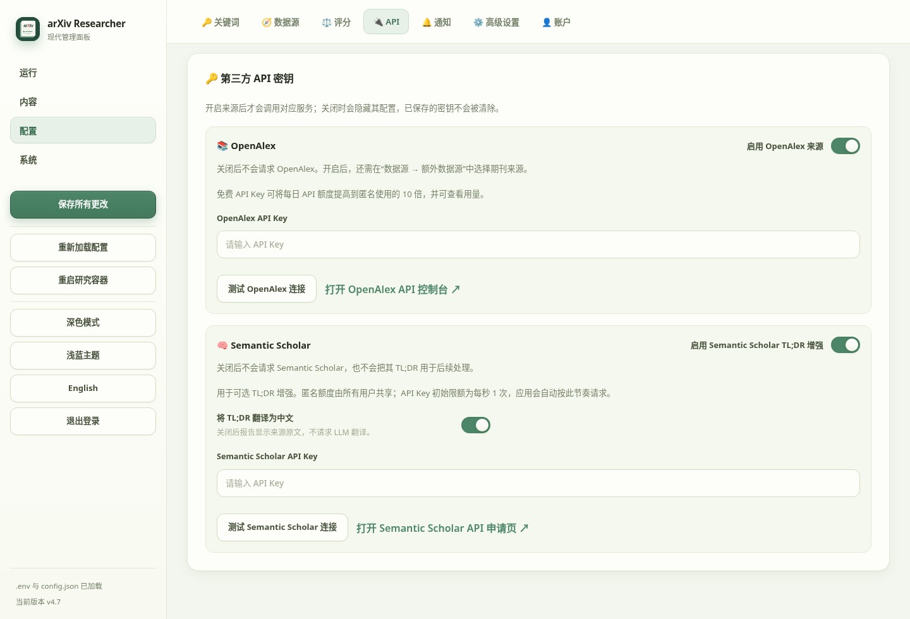

# 🔬 ArXiv Daily Researcher

**Paper monitoring, selection, analysis, and research archiving**

*Manage the path from paper discovery to archived reports in one interface.*

---

ArXiv Daily Researcher searches arXiv and other enabled sources, selects papers against a research profile, and produces translated abstracts, optional PDF analysis, and Markdown / HTML reports. The WebUI handles configuration, manual runs, reports, and historical data; the Worker handles scheduled jobs.

---

## ✨ Core Features

<table>
<tr><td colspan="2" align="center">— Discovery and selection —</td></tr>
<tr>
<td width="50%" valign="top">

### 📡 Multiple sources

Scan new and revised arXiv papers. Optional sources include PRL, PRA/PRB, Nature, Science, Hugging Face Papers, and custom journal definitions. OpenAlex and Semantic Scholar can enrich records. Matching works across sources are merged while source records remain traceable.

</td>
<td width="50%" valign="top">

### 🎯 Configurable scoring

Select papers by primary-keyword relevance, weighted keywords, or learned preferences from saved papers. An optional weighted-keyword policy assigns individual penalties to topics you do not follow. A per-run limit leaves the remaining papers in the queue.

</td>
</tr>
<tr><td colspan="2" align="center">— Analysis and delivery —</td></tr>
<tr>
<td width="50%" valign="top">

### 🔍 Abstract and PDF analysis

Configure two LLM roles for scoring, abstract translation, keywords, scoring-generated Chinese TL;DRs, and deeper analysis. English Semantic Scholar TL;DRs are translated by default; this can be turned off under API settings. If translation is unavailable, the source text stays collapsed. Parse PDFs locally with PyMuPDF or through MinerU. Failed processing stages can be retried.

</td>
<td width="50%" valign="top">

### 📄 Reports and notifications

Generate daily, past-date, supplement, focused trend, and keyword-trend reports. Delivery channels include email, WeCom, DingTalk, Telegram, Slack, and generic webhooks; each can send a test notification from the WebUI.

</td>
</tr>
<tr><td colspan="2" align="center">— Archive and operations —</td></tr>
<tr>
<td width="50%" valign="top">

### 🗃️ History and favourites

SQLite stores paper progress, delivery records, and favourites. Import legacy HTML history, fill missing paper data, scan report-date ranges for omissions, and archive supplements separately. Browse actual report batches, search papers, and mark preferences.

</td>
<td width="50%" valign="top">

### 🖥️ Management panel

The WebUI covers task state, settings, reports, backups, diagnostics, and token usage. It supports Chinese and English, light and dark themes, and administrator accounts. The sidebar shows the installed version and available updates. Token usage separates non-cached input, cached input, and output.

</td>
</tr>
</table>

---

## 📑 Navigation

| Section | Content |
| :--- | :--- |
| [🚀 Quick Start](#-quick-start) | Configure LLMs, start services, run a first task |
| [🛠️ Configuration Tools](#️-configuration-tools) | WebUI, CLI wizard, and screenshots |
| [🐳 Deployment](#-deployment) | User deployment, source tests, and upgrades |
| [📖 Feature Details](#-feature-details) | Jobs, reports, history maintenance, and data |
| [📁 Project Structure](#-project-structure) | Code and persistent directories |
| [❓ FAQ](#-faq) | Access, task, permission, and recovery issues |
| [📝 Changelog](CHANGELOG.md) | Release changes and compatibility notes |

---

## 🚀 Quick Start

You need Docker Compose, two working OpenAI-compatible LLM configurations, and network access to the paper sources.

### 1. Get the project and configure LLMs

~~~bash
git clone https://github.com/yzr278892/arxiv-daily-researcher.git
cd arxiv-daily-researcher
cp .env.example .env
~~~

Edit the `CHEAP_LLM` and `SMART_LLM` API keys, base URLs, and model names in `.env`. Both roles may use the same provider. Other settings can be completed in the WebUI. Live configuration is stored in `runtime/config.json`; `configs/config.example.json` is the tracked example.

### 2. Start the Worker and WebUI

~~~bash
docker compose pull
docker compose up -d
docker compose ps
~~~

Open `http://HOST:8501` (replace HOST with the server address) and create the administrator account. Set the research context and primary keywords, choose sources and a scoring policy, then use **Save All Changes** in the sidebar. For the weighted-keyword penalty strategy, set downweighted keywords and their weights on the Keywords page. Port 8501 should be reachable only through a controlled LAN, Tailnet, or protected reverse proxy.

### 3. Verify a research run

Set the per-run paper limit to 5 on **Daily Research**, save it, then start a manual run. The same page shows task state, queue, and logs; reports appear under **Content → Reports**. Adjust the limit after checking the workflow and notifications.

Runtime files live in `data/` and `logs/`; recreating containers does not remove these directories.

---

## 🛠️ Configuration Tools

### 🖥️ Modern Management WebUI

| Group | Main pages |
| :--- | :--- |
| Run | Daily Research, Past Daily Reports, Trend Tasks |
| Content | Reports, Favourites, Paper Search |
| Configuration | Keywords, Sources, Scoring, API, Notifications, Advanced, Accounts |
| System | Backup & Sync, History Maintenance, Diagnostics, Usage, Logs |

Use **Configuration → API** to test LLM and third-party connections, and **Configuration → Notifications** to test configured channels. Save setting changes with the sidebar button; jobs read the saved configuration when they start.

### 🧙 CLI Setup Wizard

For SSH or headless installations, run the wizard inside the Worker container:

~~~bash
docker compose exec arxiv-daily-researcher python src/utils/setup_wizard.py
~~~

It covers LLMs, paper sources, research context, scoring, notifications, and runtime settings. Back up `.env` and `runtime/config.json` before changing an existing installation.

### 🖼️ WebUI Screenshots

<table>
  <tr>
    <td align="center" width="33%"> Daily research</td>
    <td align="center" width="33%"> Usage statistics</td>
    <td align="center" width="33%"> Scoring settings</td>
  </tr>
  <tr>
    <td align="center" width="33%"> API settings</td>
    <td align="center" width="33%"> Backup and sync</td>
    <td align="center" width="33%"> History maintenance</td>
  </tr>
</table>

Screenshots use isolated demonstration data.

---

## 🐳 Deployment

### User Deployment

The root `docker-compose.yml` pins published multi-architecture images:

| Service | Image | Purpose |
| :--- | :--- | :--- |
| Worker | `ghcr.io/yzr278892/arxiv-daily-researcher:4.5` | Scheduled jobs and task processing; host network |
| WebUI | `ghcr.io/yzr278892/arxiv-daily-researcher-config-panel:4.5` | Management panel; maps 8501:8501 |

The Worker can reach a host-local LLM or proxy through `localhost`. From the WebUI container, use `host.docker.internal` to reach services on the host. Containers write bind mounts as `PUID` / `PGID` from `.env`, defaulting to 1000:1000; set these to the actual user IDs on a NAS.

Before upgrading, back up data/, runtime/, and .env and read the [changelog](CHANGELOG.md). Then:

~~~bash
git pull
docker compose pull
docker compose up -d --force-recreate
docker compose ps
~~~

If an older configuration still lives in `configs/config.json`, first startup migrates it to `runtime/config.json`. Keep the original until the new configuration is confirmed.

### Local Source Tests

`tests/docker-compose.yml` builds the current source tree for development only. Its Worker does not run scheduled jobs. It shares the workspace's `.env`, `runtime/`, and `data/` by default, so do not run it alongside a user deployment.

~~~bash
docker compose -f tests/docker-compose.yml up -d --build
docker compose -f tests/docker-compose.yml ps
docker compose -f tests/docker-compose.yml down
~~~

The repository also includes a CLI entry point and GitHub Actions workflows. Persistent deployments should retain data/, runtime/, logs/, and .env.

---

## 📖 Feature Details

### 🔄 Research Jobs

Daily research scans enabled sources, records candidates in SQLite, then scores, translates, and optionally analyses them. The per-run limit caps processing for that run; pending and failed papers remain queued. Past Daily Reports can rerun a date; Trend Tasks produce topic reports over a chosen keyword and date range.

### 📜 History Maintenance

| Action | Purpose |
| :--- | :--- |
| Legacy import | Register papers from old HTML reports in the delivery ledger |
| Historical data repair | Fill missing fields for recorded papers and update reports |
| Historical omission scan | Find missing papers within imported report-batch dates |
| Migrate existing supplements | Move older files and update SQLite report paths |

The first three maintenance jobs can run when the Worker is idle or during a chosen time window. Their paper limit is separate from the daily-research limit. Supplement reports live in data/reports/other_reports/supplement/ and appear under **Other Reports** alongside keyword trends. Saving all qualifying papers also includes papers from supplements.

### 📊 Usage, Notifications, and Backups

Token usage is shown by model and time, separating non-cached input, cached input, and output. Usage recorded in archived reports can be imported. When a legacy report has no cached-input field, its recorded input counts as non-cached input.

Job results go to enabled notification channels; failed deliveries remain queued for retry. Local backups create consistent SQLite snapshots, and WebDAV can incrementally sync selected data. Stop active jobs before restoring a database.

---

## 📁 Project Structure

~~~text
arxiv-daily-researcher/
├── docker-compose.yml         User deployment: GHCR images
├── tests/docker-compose.yml   Local source tests
├── main.py                    CLI entry point
├── src/                       Sources, analysis, reports, notifications, WebUI
├── configs/                   Configuration examples and templates
├── runtime/config.json        Live settings (Git-ignored)
├── data/                      SQLite, reports, and backups (Git-ignored)
├── logs/                      Runtime logs (Git-ignored)
└── assets/                    Sanitised UI screenshots
~~~

---

## ❓ FAQ

<b>Why can I not reach or sign in to the WebUI?</b>

Run docker compose ps and check that config-panel is healthy, then check port 8501 and the host firewall. First access requires administrator setup. Existing credentials are stored in the local .env configuration; recreating the container does not reset them. Inspect recent logs with docker compose logs --tail=100 config-panel.

<b>Why has a submitted job not started?</b>

Check docker compose ps and docker compose logs --tail=100 arxiv-daily-researcher. History maintenance may be waiting for an idle Worker or its configured time window; **System → History Maintenance** shows its state. Pending daily papers stay in SQLite for the next run.

<b>What if a container cannot write to a mounted directory?</b>

Use id to find the host user's UID/GID, set PUID and PGID in .env, and recreate the containers. Do not remove data/ or leave its files owned by root.

<b>What should I check after an LLM 429, timeout, or partial analysis failure?</b>

Inspect the failed stage in **System → Diagnostics** and test the connection under **Configuration → API**. Check the model name, base URL, account quota, rate limits, and proxy. Once fixed, run the task again; completed paper stages remain recorded.

<b>Which files need backing up before an upgrade?</b>

Keep .env, runtime/, data/, and any logs/ you need. **System → Backup & Sync** can also create a SQLite snapshot. Backing up the repository alone does not preserve the paper ledger, favourites, or reports stored in data/.

---

## 📜 License

This project is licensed under [AGPL-3.0](LICENSE).

## 💬 Feedback

Use [GitHub Issues](https://github.com/yzr278892/arxiv-daily-researcher/issues) for bugs and suggestions. Include deployment details, reproduction steps, and redacted log excerpts.

## 🙏 Acknowledgements

Thanks to [arXiv](https://arxiv.org/), [OpenAlex](https://openalex.org/), [Semantic Scholar](https://www.semanticscholar.org/), and [MinerU](https://mineru.net/) for their data and tools. Follow each provider's quotas and terms.

## 📝 Changelog

See [CHANGELOG.md](CHANGELOG.md) for release changes and upgrade notes.
